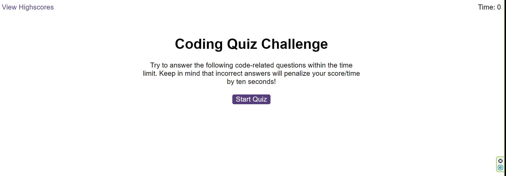
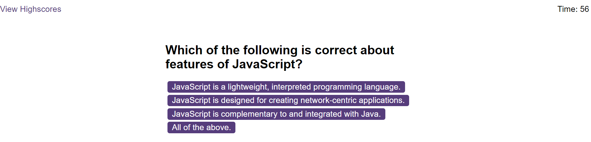

# Code-Quiz
# Description

This is a simple timed quiz game that allows a user to answer a set of 10 questions on javascript in 60 seconds. The scores are saved and the user can see the scores.  

# Installation
N/A

# Usage
  Click 'Start Quiz' and answer the questions when prompted. You can see the timer in the top-right of the screen. For each question, you will be notified if you have answered correctly or not. An incorrect answer results in a penalty of 10 seconds. At the end, you will be presented with your score and asked to insert your initials to save your score.

  When all the questions are answered or the timer reaches 0, then the game is over. When the game is over, you can enter your initials to save your score. When multiple players play the game and save their scores, these will be saved as a list of high scores. This list can be cleared by clicking on 'Clear High Scores'.

  Use this link to give it a try!: https://eampofu.github.io/Code-Quiz/
# Credits
questions for the quiz are taken from https://www.tutorialspoint.com/javascript/javascript_online_quiz.htm

# Screen shots

# Licence
MIT. Please see original GitHub repository.